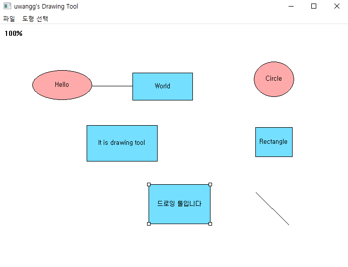

# uwangg's Drawing Tool like PowerPoint

# DrawingTool_WinApi
OnePage DrawingTool using WinApi, C++

# Development period
2016.11.14 ~ 2016.12.04

# developer
uwangg

# Development language
C++, WinApi

# Features
- File Save & Load (XML & txt)
- Zoom in/Out (Mouse Wheel)
- Panning (Mouse Right Button)
- Draw various Shape style (Circle, Rect, Line)
- Select Shape individual
- Move shape
- Resize shape
- write text in Shape
- Support IME
